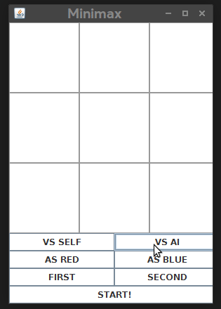
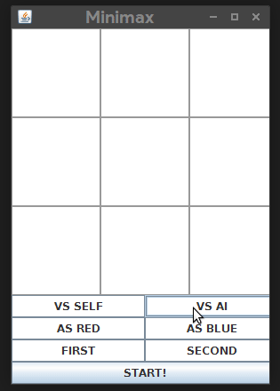

# Unbeatable TicTacToe

This project is an exercise for CMSC 170 - Artificial Intelligence in UPLB. It uses own implementations of the minimax and the alpha-beta pruning algorithms in creating an unbeatable AI.

## Files

It has three files:

1. **Minimax.java** - The Minimax file, where the instance of the GUI is included. The algorithm is also included in the main file.
2. **AlphaBeta.java** - The Minimax algorithm with Alpha-beta Pruning applied.
3. **Board.java** - The underlying code for the creation of the board, checking for winners, and storing available moves.
4. **GUI.java** - Well, for the GUI. Movements for the AI and the player is also here.

## Game Screenshots

_The AI wins._

_The game ends as a draw._

